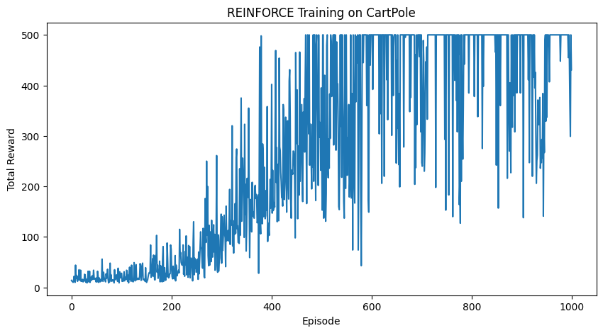
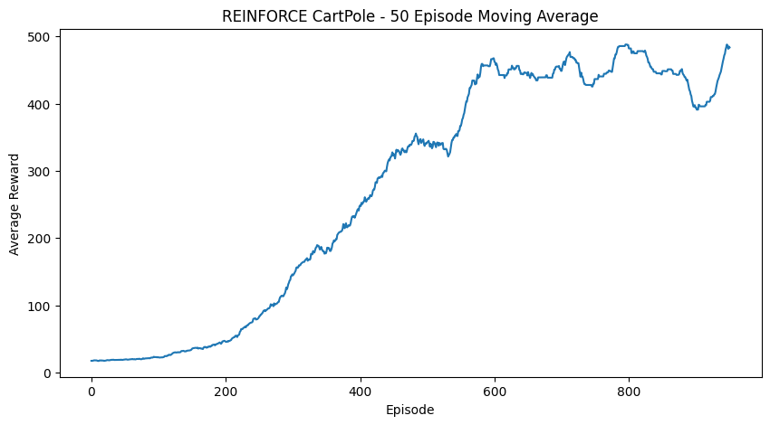

# REINFORCE Policy Gradient for CartPole

## Overview

This project implements the REINFORCE policy-gradient algorithm to train an agent on the `CartPole-v1` environment using PyTorch and Gymnasium.

The goal is to train a policy network that learns how to balance the pole by selecting actions based on the current environment state.

## Method

A neural network is used to represent the policy. The network takes the current environment state as input and outputs a probability distribution over the available actions.

During training:

1. The policy generates action probabilities from the current state.
2. An action is sampled from the probability distribution.
3. Rewards and log probabilities are stored during the episode.
4. Discounted returns are calculated after the episode.
5. The policy parameters are updated using the REINFORCE policy-gradient objective.

## Model Architecture

- Input: 4 CartPole state variables
- Hidden layer: 128 neurons with ReLU activation
- Output: 2 action probabilities using Softmax

## Training Configuration

- Environment: CartPole-v1
- Training episodes: 1,000
- Discount factor: 0.99
- Optimizer: Adam
- Learning rate: 0.001
- Evaluation episodes: 20

## Results

The trained policy achieved:

- Average test reward: **500.0**
- Standard deviation: **0.0**
- Maximum reward achieved in all 20 evaluation episodes

The result indicates that the learned policy was able to consistently balance the pole for the full episode during evaluation.

## Technologies

- Python
- PyTorch
- Gymnasium
- NumPy
- Matplotlib

## Key Concepts

- Reinforcement Learning
- Policy Gradient
- REINFORCE
- Neural Networks
- Discounted Returns
- Stochastic Policy
- Policy Evaluation


## Run locally

```bash
python -m venv .venv
source .venv/bin/activate
pip install -r requirements.txt
jupyter lab reinforce_cartpole.ipynb
```

On Windows, activate with `.venv\Scripts\activate`. Run notebook cells in order; training precedes evaluation. Dependencies are unpinned, so package versions may affect reproducibility.

## Saved experiment previews

These figures are extracted from the notebook’s existing outputs, not a new training run.





## Reproducibility limits

Results describe the saved experiment rather than a guarantee for new runs. Training was not repeated during this documentation update. The notebook seeds NumPy and PyTorch but does not explicitly seed environment resets. Evaluation uses greedy actions across 20 episodes.
